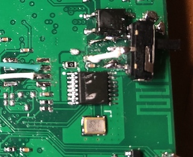

The Bluetooth management interface of JK-BMS poses significant security risks. It's hard to imagine that a system overseeing tens of thousands of ampere-hours of energy can freely modify various battery data through an insecure wireless connection. Besides the potential damage to the battery cells, there is even a risk of battery overcharging leading to combustion.

I have submitted a request to the manufacturer to disable the Bluetooth functionality. Until the manufacturer provides a solution, I have added a physical power switch to the Bluetooth module. This allows me to deactivate its wireless capabilities after configuring parameters through Bluetooth.



Next, I will modify the Bluetooth connection to enable control of Bluetooth and BMS through software. Special thanks to @syssi for the assistance.

```
                UART-TTL
┌──────────┐                ┌─────────────┐                ┌──────────┐
│          │<----- RX ------│tx1       rx2│<----- RX ------│          │
│  JK-BMS  │------ TX ----->│rx1 ESP32 tx2│------ TX ----->│ JK-BMS   │
│          │<----- BLE -----│             │<----- BLE------│ Bluetooth│
│          │------ 3.3v---->│             │------ 3.3v---->│ module   │
│          │<----- GND ---->│             │<----- GND----->│          │
│          │                │             │                │          │
└──────────┘                └─────────────┘                └──────────┘

```


